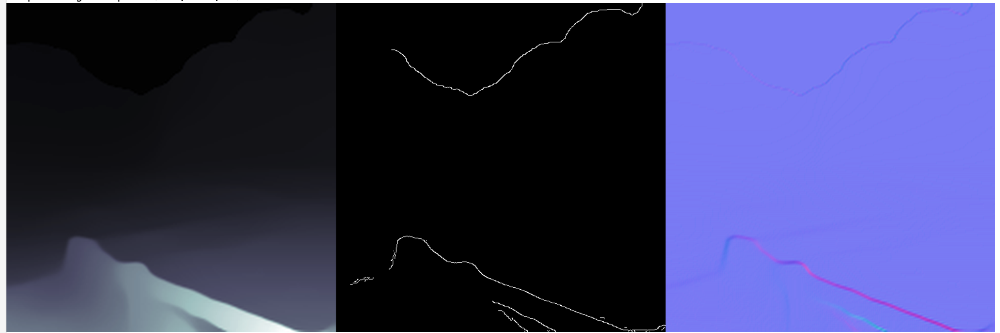

In [notebook_02.ipynb](/notebook_02.ipynb) tried mutliple pipelines different combination of control net conditioning such as :
- depth
- depth, canny
- depth, normal
- depth, canny, normal
- depth , normal , canny
- canny, depth, normal

Some input depth images, such as 168x168 or 177x177, result in distorted outputs, sometimes even generating NSFW content. 
Additionally, a depth image with a resolution of 2668x2668 produces very noisy outputs. 
Therefore, decided to resize all inputs to a standard size of 512x512.

Also normalized input depth image to (0,255)

## Final Pipeline
1. Normalize each depth image such that its pixel values are scaled between 0 and 255. This normalization ensures that all depth images are on a comparable scale for visualization and processing.
2. Resize all depth images to a standard size of 512x512xch pixels to ensure uniform input to the model and ease of comparison across various images. Using this fixed size simplifies the processing pipeline.
3. Convert depth image to normals, then use ControlNet pipeline to apply depth conditioning followed by normals conditioning for improved generation.

text_prompts = ["beautiful landscape, mountains in the background",
"luxury bedroom interior",
"Beautiful snowy mountains",
"luxurious bedroom interior",
"walls with cupboard",
"room with chair",
"House in the forest"]

### beautiful landscape, mountains in the background

Also extracted depth from generated output using [Monocular depth estimation](https://huggingface.co/docs/transformers/en/tasks/monocular_depth_estimation) and verified visually.
It is visually almost same. 

See [final_pipeline.ipynb](/final_pipeline.ipynb) for the final output.

In [aspect_ratio.ipynb](/aspect_ratio.ipynb), it was demonstrated that for a given text prompt, we have two different depth images: 
one with an aspect ratio of 1:1 and the other with an aspect ratio close to 16:9.

